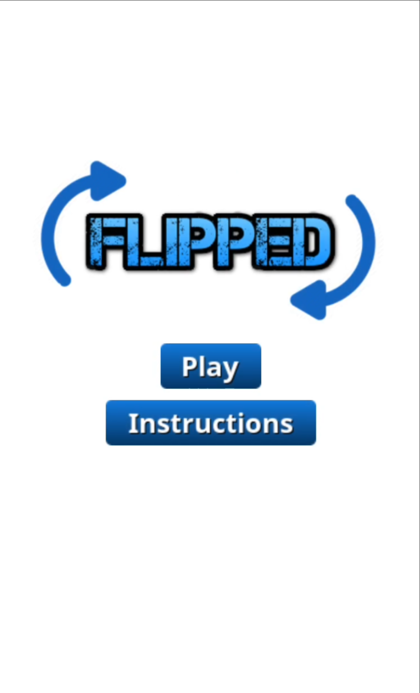
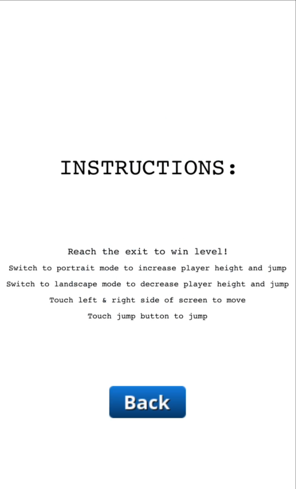
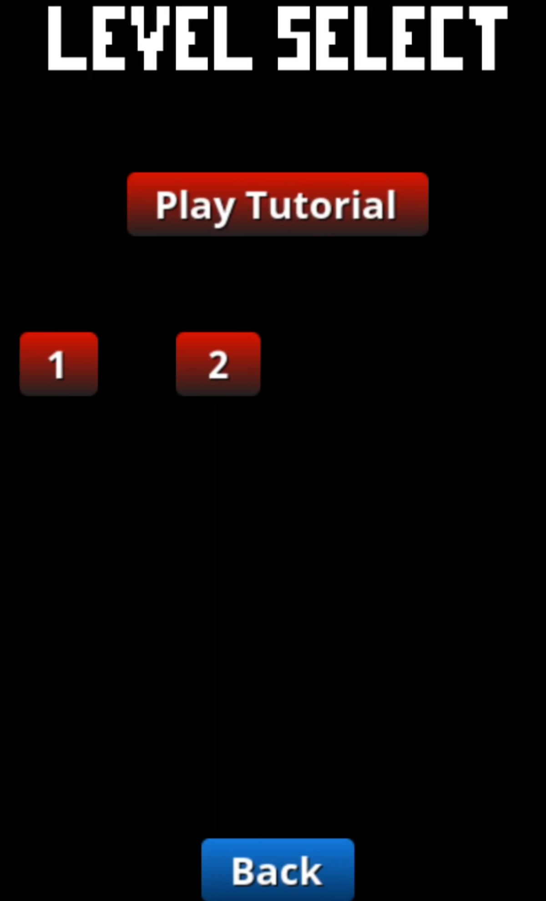
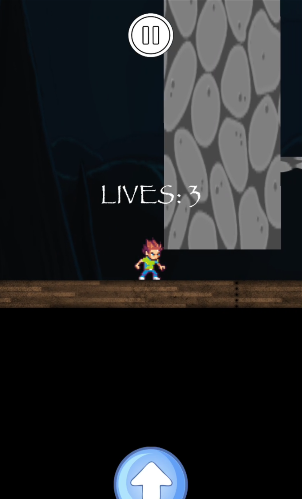
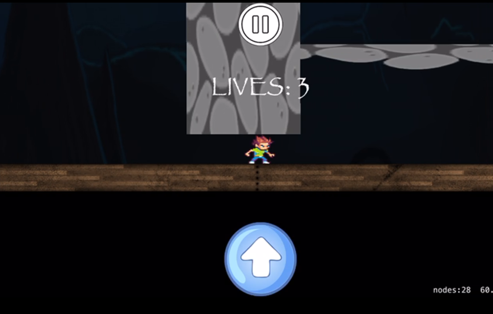
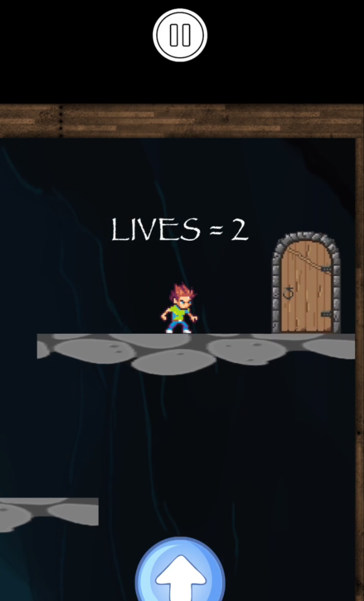
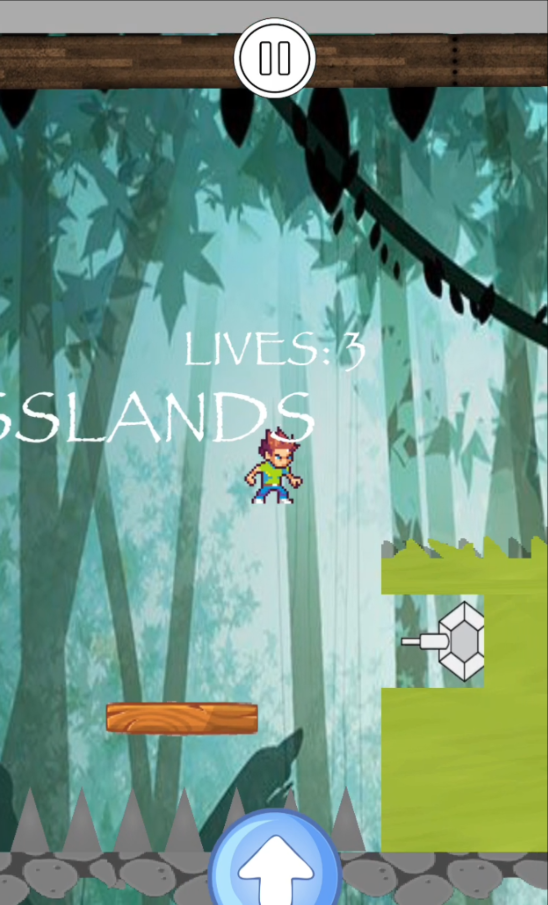
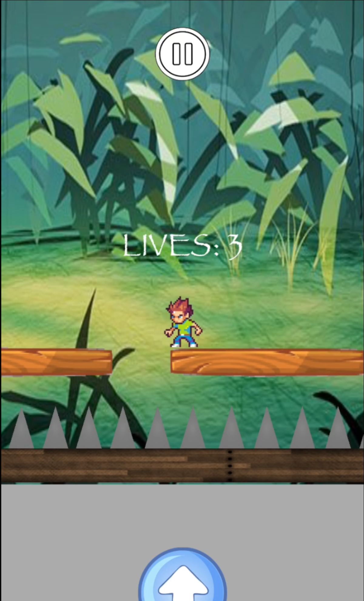

## Flipped Game

An iOS mobile game developed in Swift 4 with fellow developer, Colin Leslie. Flipped is a simple 2D Platformer game where the physics of the player sprite is dependent on the physical orientation of the device. Flipped uses Swift's sprite kit framework for making gaming applications. 

 

Players will navigate from left to right through various different levels using an on screen D-pad, jumping on platforms and over obstacles and manoeuvring around other deadly objects like cannons and spikes in order to reach the level exit and progress to the next level. 

Flipped adds an interesting feature in which in takes advantage of the device's physical orientation. For certain obstacles in each level, players must rotate their device in order to progress through the obstacle. By rotating the device, the character's size and jump height is different. When the device is in portrait mode, the players size grows taller and jumping height increases. When the device is in landscape mode, the players size shrinks and jumping height decreases. Landscape mode helps with obstacles such as small gaps while portrait mode helps with reaching high platforms. Each level offers a way to take advantage of this mechanic! 

Here is an example gameplay (Screen-shots):

At this segment of the first level, it is clear to see that the players height is too tall to fit through the small gap. In order to pass through this gap, the device must be rotated to landscape mode in which the characters size shrinks, as so: 

By rotating to landscape mode, the characters size shrinks and is now able to pass through the gap, reaching the other side of the level. 

Once the player reaches the exit door in each level, the level is then completed.

Other levels incorporate other obstacles such as cannons, moving platforms, spikes and more! 
